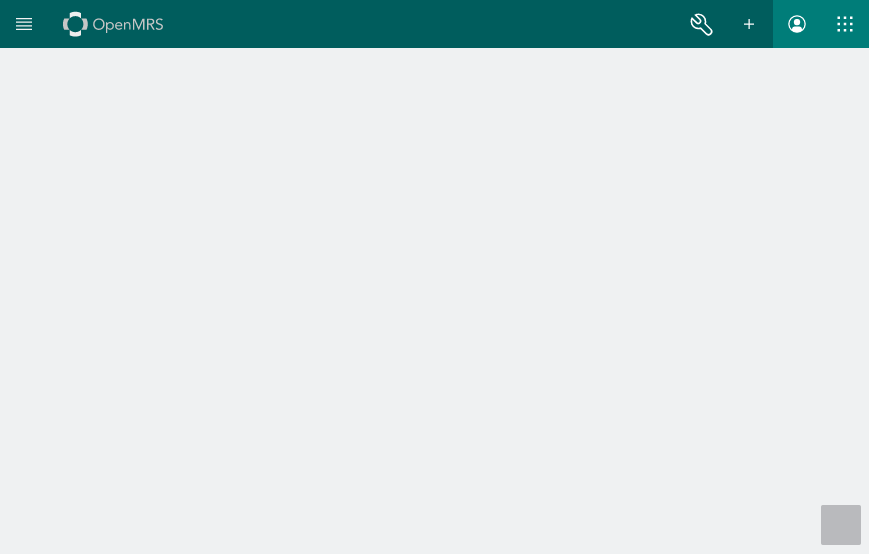

[](https://github.com/ivanruby/openmrs-esm-helloworld-app/actions/workflows/node.js.yml)

# OpenMRS ESM HelloWorld App

A simple [OpenMRS Microfrontend](https://wiki.openmrs.org/display/projects/Frontend+-+SPA+and+Microfrontends) for learning and development purposes

## Folder structure highlights

- `src` - Main files for the app
- `src/index.ts` - Performs configurations and loads root.component.ts
- `src/root.component.ts` - Loads and routes components for the app around a user context
- `src/<component name>`
  - `src/<component name>/<component name>.component.tsx` - Main component file
  - `src/<component name>/<component name>.component.test.tsx` - Tests for the component
  - `src/<component name>/<component name>.resource.tsx` - Helpers for component (e.g. API interaction)

---

## How do I use it?

First, make sure to fork this repo.

### Installation

Clone the forked repo to your computer and proceed as:

```sh
git clone https://github.com/<your github username>/openmrs-esm-helloworld-app.git
cd openmrs-esm-helloworld-app
npm install
npm run start
```

The core app will be served on `localhost:8080`

On a separate terminal, serve the local microfrontend module

```sh
npm run serve
```

The module will be served on `localhost:8081`

Now, on a browser, navigate to `localhost:8080`. Your screen should look like this:



---

### How do I check that the module is running?

1. On the core app, click on the bottom right square on the screen to open `dev-tools`
2. Then, scroll down the list of modules and locate the module `@openmrs/esm-helloworld-app`
   It should look like this:
   
3. Close the `dev-tools` window
4. Navigate to `localhost:8080/openmrs/spa/hello`, where your screen should look like this:
   

Note: Whenever you create a module, it is displayed by navigating to an assigned route.

---

### How do I modify this project and create my own app?

#### Step 1

Before making the desired changes, make sure to:

1. On `webpack.config.js`, replace all instances of `helloworld` by the name of your app
2. On `package.json`, replace all instances of 'helloworld' by the name of your app
3. On `src/index.ts`, replace `@openmrs/esm-helloworld-app` by `@openmrs/esm-<appname>-app` on line 17
4. On `src/index.ts`, replace `featureName: 'helloworld'` by `featureName: '<appname>` on line 20
5. On `src/index.ts`, replace `route: 'hello'` by `route: '<chosen route for app>'` on line 30
   This is how you will be able to access your module
6. On `src/set-public-path.ts`, replace `@openmrs/esm-helloworld-app` by `openmrs/esm-<appname>-app`

#### Step 2

Test the module with the name changed by running

```sh
npm run start
```

And, on another terminal

```sh
npm run serve
```

- Now, navigate to `localhost:8080` and check that the `@openmrs/esm-helloworld-app` has been changed to `@openmrs/esm-<your appname>-app` on `dev-tools`
- Lastly, navigate to your chosen route like `localhost:8080/openmrs/spa/<route>`

#### Step 3

Make desired changes

#### Step 4

Create a local build

```sh
npm run build
```

#### Step 5

Create a centralized build by pushing to the github repo. Before doing so, check `.git/workflows/node.js.yml` for the build jobs and make sure to add the corresponding secrets to your github repo.
Next, you can

```sh
git add .
git commit
git push
```

---

## Future Branches

- [helloworld](): Main branch with descriptions
- [helloworld-translations](): Branch to demo translation feature
- [helloworld-tests](): Branch to demo tests
- [helloworld-deploy](): Branch to demo the deployment process
- [helloworld-ws-patient-data](): Branch to demo interaction with the openmrs API
